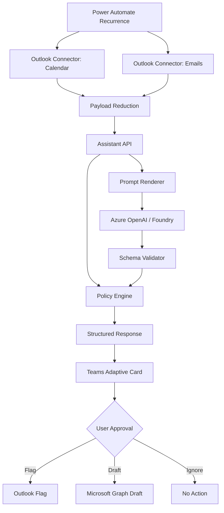

# Architecture Diagram

```mermaid
flowchart TD
    A[Power Automate Recurrence] --> B[Outlook Connector: Calendar]
    A --> C[Outlook Connector: Emails]
    B --> D[Payload Reduction]
    C --> D
    D --> E[Assistant API]
    E --> F[Prompt Renderer]
    E --> G[Policy Engine]
    F --> H[Azure OpenAI / Foundry]
    H --> I[Schema Validator]
    I --> G
    G --> J[Structured Response]
    J --> K[Teams Adaptive Card]
    K --> L{User Approval}
    L -->|Flag| M[Outlook Flag]
    L -->|Draft| N[Microsoft Graph Draft]
    L -->|Ignore| O[No Action]
```
